# Лабораторная работа №6: Система контроля версий

**Студент**: Веденкин Юрий Юрьевич 

**Группа**: 4318

# Описание работы

Цель лабораторной работы: изучение базовых возможностей системы
управления версиями, опыт работы с Git Api, опыт работы с локальным и
удаленным репозиторием. 

# Содержание
1. [Копирование репозитория и создание fork](#fork-repository)
2. [Настройка клиента Git](#client-settings)
3. [Клонирование своего репозитория на компьютер](#clone-repository)
4. [Добавление файла через интерфейс GitHub](#Adding-file)
5. [Получение историю операций для каждой из веток](#take-history)
6. [Просмотреть последние изменения](#looking-last-history)
7. [Слияние в ветку master с разрешением конфликта](#checkout)
8. [Удаление побочной ветки после слияния](#delete-branch)
9. [Сделать изменения и зафиксировать их несколько раз](#editing-n-fixing)
10. [Сделать откат коммита](#reverting)
11. [Создать ветку для отчёта](#checkout-branch)
12. [Получить историю операций в форматированном виде](#take-history-last)
13. [Вывод](#vyvod)


<a name="fork-repository"></a>

# Копирование репозитория и создание fork
Сделана копия в личное хранилище из https://github.com/Kurtyanik/LR6/

<a name="client-settings"></a>

# Настройка клиента Git
1. Откроем командную строку или терминал (Windows: PowerShell, Linux/Mac: терминал).
2. Введем следующие команды для настройки имени пользователя и email:

```bash
git config --global user.name "4318 Веденкин Ю.Ю. "
git config --global user.email "yurayidess@gmail.com"
```

Эти данные будут использоваться для идентификации автора коммитов.


<a name="clone-repository"></a>

# Клонирование своего репозитория на компьютер
1. Найдем наш форкнутый репозиторий на нашем GitHub аккаунте.
2. Нажмем кнопку "Code" и скопируем ссылку для клонирования (HTTPS или SSH).
3. В терминале выполним команду:

```bash
git clone <скопированная_ссылка>
```

Это скопирует удалённый репозиторий на наш компьютер.


<a name="Adding-file"></a>

# Добавление файла через интерфейс GitHub
1. Перейдем в наш репозиторий на GitHub.
2. Нажмем на "Add file" -> "Upload files" и добавим новый файл (например, test.txt).
3. В терминале на компьютере выполним команду для подтягивания изменений:

```bash
git pull
```

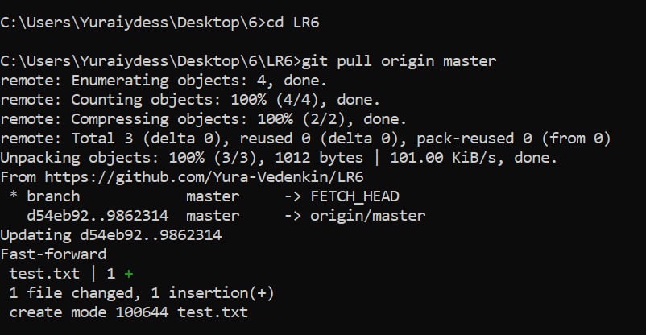

Это обновит наш локальный репозиторий новыми изменениями.


<a name="take-history"></a>

# Получение историю операций для каждой из веток
В терминале выполним команду:

```bash
git log --oneline --graph --all
```

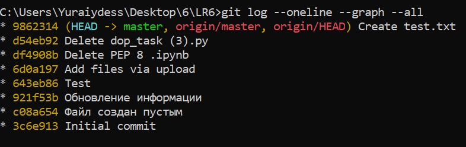

Это покажет историю коммитов с сокращёнными хэшами для всех веток.


<a name="looking-last-history"></a>

# Просмотреть последние изменения
Выполним команду:

```bash
git log 
```

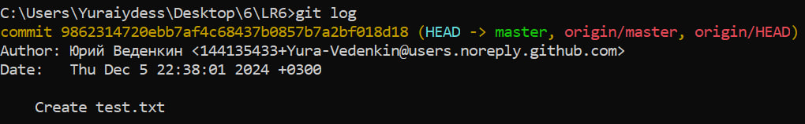

Это покажет информацию о последнем коммите.


<a name="checkout"></a>

# Слияние в ветку master
Переключимся на ветку two:

```bash
$ git checkout -b two
$ git push --set-upstream origin two
$ git add .  
$ git commit -m "Изменения в новой ветке"
```
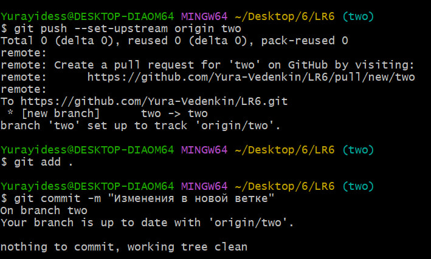

Выполним команду слияния:

```bash
$ git checkout master
$ git merge new-two
```
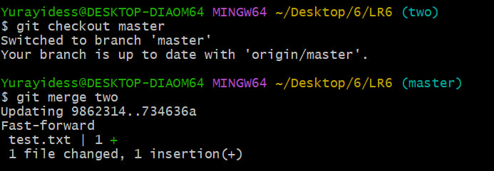

<a name="delete-branch"></a>

# Удаление побочной ветки после слияния
После успешного слияния выполним команду для удаления ветки:

```bash
git branch -d <имя_ветки>
```

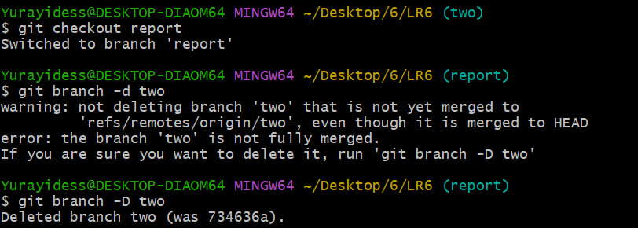

<a name="editing-n-fixing"></a>

# Сделать изменения и зафиксировать их несколько раз
1. Внесем изменения в несколько файлов или один файл несколько раз.
2. Зафиксируйем изменения с комментариями:

```bash
git add .
git commit -m "Комментарий к изменению"
```

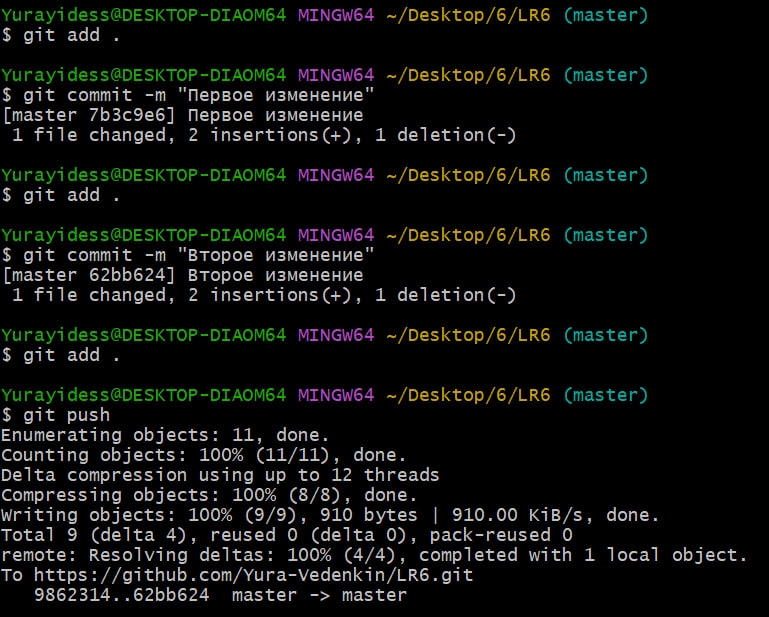

<a name="reverting"></a>

# Сделать откат коммита
Удаление последнего коммита с помощью команды:

```bash
$ git reset --hard HEAD~1
```
*Скриншот отката*


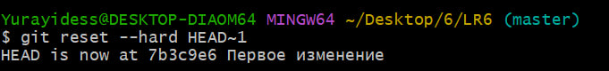

Загрузил на GitHub локальные данные:

```bash
$ git push --force origin master
```
*Обновил данные на GitHub*


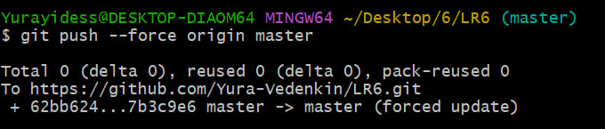

*Обновленные данные на GitHub*


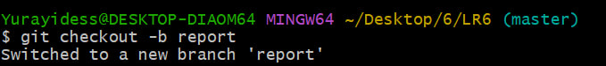

<a name="checkout-branch"></a>

# Создать ветку для отчёта
Создадим новую ветку:

```bash
git checkout -b report
```

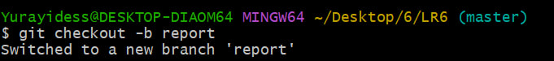


<a name="take-history-last"></a>

# Получить историю операций в форматированном виде
Выполним команду:

```bash
git log --pretty=format:"%h %ad %an %s" --date=short
```

Список истории операций:

```bash
7b3c9e6 2024-12-05 Yura-Vedenkin Первое изменение
734636a 2024-12-05 Yura-Vedenkin Изменения в новой ветке
9862314 2024-12-05 Юрий Веденкин Create test.txt
643eb86 2024-12-01 Юрий Веденкин Test
921f53b 2020-11-21 Kurtyanik Обновление информации
c08a654 2020-11-21 Kurtyanik Файл создан пустым
3c6e913 2020-11-21 Kurtyanik Initial commit
```


<a name="vyvod"></a>
# Вывод
В ходе выполнения лабораторной работы №6 освоены основные команды Git и приобретены навыки работы с удалёнными репозиториями на GitHub. Изучены процессы форкования, клонирования, коммитинга, слияния веток, разрешения конфликтов и отката коммитов. Также получен опыт использования графических инструментов, таких как VSCode, для управления версиями.
